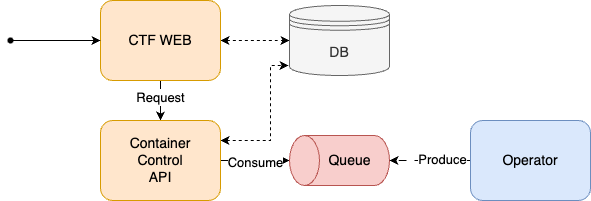

# Challenge API

HexaCTF의 Container Control 프로젝트의 일부입니다. 

클라이언트로부터 커스텀 리소스인 Challenge를 제어하기 위해 사용되는 Control API입니다.

> [!NOTE]  
> Challenge에 대한 정보는 [Challenge Operator](https://github.com/HexaCTF/challenge-operator)를 참고해주세요.

## 아키텍쳐

[Challenge Operator](https://github.com/HexaCTF/challenge-operator)에서 상태가 변경되면 큐에 상태 메시지를 전송합니다. Challenge API는 큐에 있는 상태 메세지를 얻어 데이터베이스에 값을 저장합니다.

> [!TIP]  
> Challenge API 제작에 관한 내용은 [블로그](https://medium.com/s0okju-tech/hexactf-10-%EC%95%84%ED%82%A4%ED%85%8D%EC%B3%90-%EC%84%A4%EA%B3%84-%EB%B0%8F-challenge-control-api-%EC%A0%9C%EC%9E%91-7eac7a44fc5c)에 자세히 나와 있습니다.

## API

|                          Endpoint                           | Method |     Description     |
| :---------------------------------------------------------: | :----: | :-----------------: |
|        [/v1/user-challenges](./md/user-challenge.md)        |  POST  |   Challenge 생성    |
| [/v1/user-challenges/delete](./md/user-challenge-delete.md) |  POST  |   Challenge 삭제    |
| [/v1/user-challenges/status](./md/user-challenge-status.md) |  GET   | Challenge 상태 조회 |

